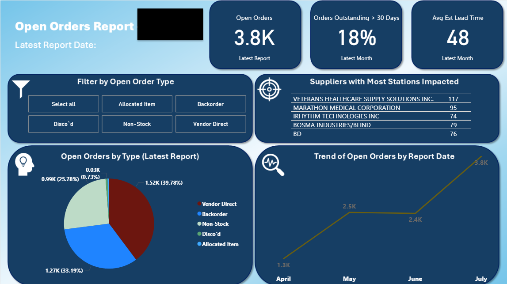
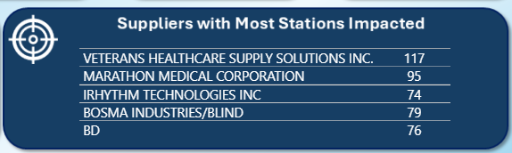

# 📊 Open Orders Report – Medical Distributor

## 📌 Overview
This Power BI dashboard was developed to track open orders, monitor lead time, and assess vendor performance for medical supply distribution.

## 🏆 Business Problem
The Program Office lacked a centralized, visual way to monitor:
- Aging orders (especially those over 30 days)
- Delivery performance by supplier
- Impact of delayed orders on facilities

## 🛠 Tools & Techniques
- **Power BI** for interactive visualization
- **Data Modeling** to integrate multiple order data sources
- **Custom Measures** to calculate aging risk and lead times

## 💡 Key Features
- KPI cards for total open orders, % >30 days, and average estimated lead time
- Pie chart showing open orders by type for the latest reporting period
- Time series showing trends over time
- Table ranking suppliers by number of facilities impacted

## 📈 Impact
- Enabled leadership to identify and address supply chain disruptions quickly
- Saved an estimated **$1M+ in labor hours annually** by replacing manual reporting
- Supported executive oversight and accountability

## 🖼 Screenshots

